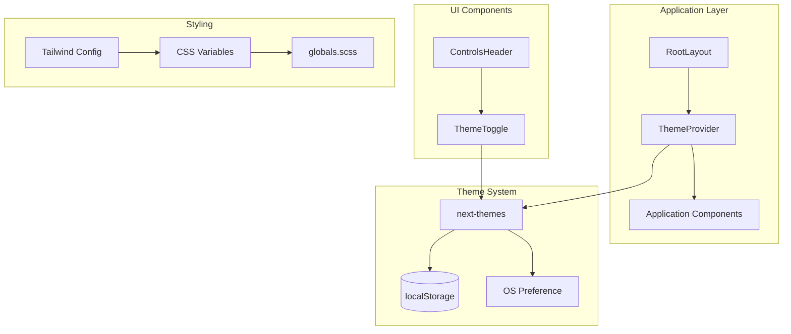
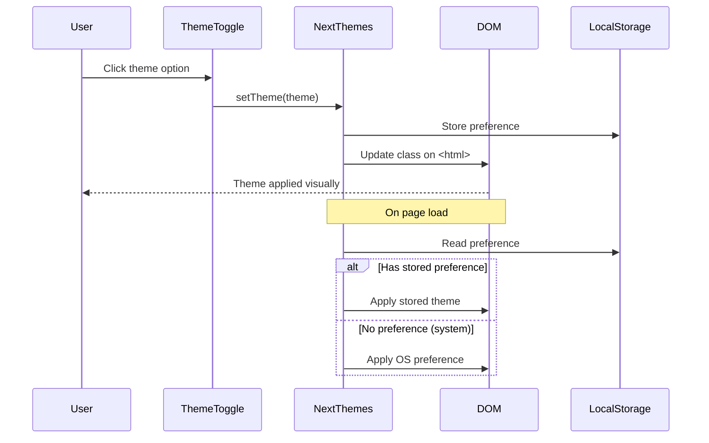

# Design Document: Dark Theme Feature

## Overview

This design document outlines the implementation of a dark theme feature for the Allama frontend application. The implementation leverages the existing infrastructure (CSS variables, Tailwind dark mode configuration, and the next-themes package) to provide a seamless theme switching experience.

The approach involves:
1. Creating a ThemeProvider wrapper component using next-themes
2. Creating a theme toggle dropdown component with Sun/Moon icons
3. Migrating hardcoded color classes to CSS variable-based alternatives
4. Integrating the toggle into the existing header/navigation structure

## Architecture



### Theme Flow



## Components and Interfaces

### ThemeProvider Component

**Location:** `frontend/src/providers/theme.tsx`

```typescript
"use client"

import { ThemeProvider as NextThemesProvider } from "next-themes"
import type { ThemeProviderProps } from "next-themes"

export function ThemeProvider({ children, ...props }: ThemeProviderProps) {
  return <NextThemesProvider {...props}>{children}</NextThemesProvider>
}
```

**Integration in layout.tsx:**
```typescript
import { ThemeProvider } from "@/providers/theme"

// In RootLayout:
<ThemeProvider
  attribute="class"
  defaultTheme="system"
  enableSystem
  disableTransitionOnChange
>
  {children}
</ThemeProvider>
```

### ThemeToggle Component

**Location:** `frontend/src/components/theme-toggle.tsx`

```typescript
"use client"

import { Moon, Sun } from "lucide-react"
import { useTheme } from "next-themes"
import { Button } from "@/components/ui/button"
import {
  DropdownMenu,
  DropdownMenuContent,
  DropdownMenuItem,
  DropdownMenuTrigger,
} from "@/components/ui/dropdown-menu"

export function ThemeToggle() {
  const { setTheme, theme } = useTheme()

  return (
    <DropdownMenu>
      <DropdownMenuTrigger asChild>
        <Button variant="ghost" size="icon" className="h-7 w-7">
          <Sun className="h-4 w-4 rotate-0 scale-100 transition-all dark:-rotate-90 dark:scale-0" />
          <Moon className="absolute h-4 w-4 rotate-90 scale-0 transition-all dark:rotate-0 dark:scale-100" />
          <span className="sr-only">Toggle theme</span>
        </Button>
      </DropdownMenuTrigger>
      <DropdownMenuContent align="end">
        <DropdownMenuItem onClick={() => setTheme("light")}>
          Light
          {theme === "light" && <span className="ml-auto">✓</span>}
        </DropdownMenuItem>
        <DropdownMenuItem onClick={() => setTheme("dark")}>
          Dark
          {theme === "dark" && <span className="ml-auto">✓</span>}
        </DropdownMenuItem>
        <DropdownMenuItem onClick={() => setTheme("system")}>
          System
          {theme === "system" && <span className="ml-auto">✓</span>}
        </DropdownMenuItem>
      </DropdownMenuContent>
    </DropdownMenu>
  )
}
```

### Color Migration Map

| Original Class | Replacement Class | Rationale |
|---------------|-------------------|-----------|
| `bg-white` | `bg-background` | Uses CSS variable that adapts to theme |
| `bg-white` (on buttons) | `bg-card` | Provides subtle elevation in both themes |
| `bg-zinc-50` | `bg-sidebar` | Sidebar-specific variable already defined |
| `bg-zinc-900` | `bg-foreground` | Inverts appropriately in dark mode |
| `bg-zinc-950` | `bg-sidebar` (dark variant) | Uses sidebar variable |
| `border-zinc-200` | `border-border` | Theme-aware border color |
| `border-zinc-800` | `border-border` | Consolidates to single variable |

### Files Requiring Modification

1. **Provider Setup:**
   - `frontend/src/providers/theme.tsx` (new file)
   - `frontend/src/app/layout.tsx` (wrap with ThemeProvider)

2. **Theme Toggle:**
   - `frontend/src/components/theme-toggle.tsx` (new file)
   - `frontend/src/components/nav/controls-header.tsx` (add toggle to header)

3. **Color Migrations:**
   - `frontend/src/components/badges.tsx`
   - `frontend/src/components/nav/controls-header.tsx`
   - `frontend/src/components/workspaces/add-workspace-member.tsx`
   - `frontend/src/components/ui/sidebar.tsx`
   - `frontend/src/components/cases/add-custom-field.tsx`
   - `frontend/src/components/cases/add-case-duration.tsx`
   - `frontend/src/components/cases/add-case-tag.tsx`
   - `frontend/src/components/cases/cases-feed-event.tsx`
   - `frontend/src/components/dashboard/create-workflow-button.tsx`
   - `frontend/src/components/tables/table-insert-button.tsx`
   - `frontend/src/components/integrations/create-custom-provider-dialog.tsx`
   - `frontend/src/components/integrations/mcp-integration-dialog.tsx`
   - `frontend/src/app/page.tsx`

## Data Models

No new data models are required. The theme preference is stored in localStorage by next-themes using the key `theme`.

**Storage Format:**
```typescript
// localStorage key: "theme"
// Possible values: "light" | "dark" | "system"
type ThemePreference = "light" | "dark" | "system"
```


## Correctness Properties

*A property is a characteristic or behavior that should hold true across all valid executions of a system—essentially, a formal statement about what the system should do. Properties serve as the bridge between human-readable specifications and machine-verifiable correctness guarantees.*

Based on the prework analysis, the following properties can be tested:

### Property 1: Theme Class Application

*For any* theme value in ["light", "dark"], when that theme is set via the ThemeProvider, the document's `<html>` element should have the "dark" class if and only if the theme is "dark".

**Validates: Requirements 1.2, 2.3, 2.4**

### Property 2: Theme Persistence Round-Trip

*For any* theme value in ["light", "dark", "system"], storing the theme preference and then retrieving it from localStorage should return the same theme value.

**Validates: Requirements 1.4**

### Property 3: Active Theme Indication

*For any* theme value that is currently selected, the theme toggle dropdown should indicate that specific option as active (with a checkmark or similar indicator).

**Validates: Requirements 2.7**

## Error Handling

### Theme Loading Errors

| Scenario | Handling |
|----------|----------|
| localStorage unavailable | Fall back to system theme preference |
| Invalid theme value in storage | Reset to "system" default |
| next-themes fails to load | Application renders with default light theme (CSS :root variables) |

### Hydration Mismatch Prevention

The ThemeProvider uses `suppressHydrationWarning` on the `<html>` element to prevent React hydration warnings when the server-rendered theme differs from the client's stored preference. The `disableTransitionOnChange` prop prevents flash of incorrect colors during initial load.

### Graceful Degradation

If JavaScript is disabled or fails to load:
- The application will render with the light theme (default CSS variables in :root)
- All UI elements remain functional, just without theme switching capability

## Testing Strategy

### Unit Tests

Unit tests should verify specific examples and edge cases:

1. **ThemeProvider Integration Test**
   - Verify ThemeProvider renders children correctly
   - Verify default theme is "system" when no localStorage value exists
   - Verify theme toggle renders with correct initial state

2. **ThemeToggle Component Tests**
   - Verify dropdown opens on click
   - Verify all three options (Light, Dark, System) are present
   - Verify clicking each option calls setTheme with correct value

3. **Color Migration Verification**
   - Verify no `bg-white` classes remain in migrated components
   - Verify sidebar uses `bg-sidebar` class
   - Verify buttons use `bg-background` or `bg-card` classes

### Property-Based Tests

Property tests should use a testing library like `fast-check` for JavaScript/TypeScript. Each test should run a minimum of 100 iterations.

**Test Configuration:**
- Library: `fast-check` (or `@fast-check/jest` for Jest integration)
- Minimum iterations: 100 per property

**Property Test 1: Theme Class Application**
```typescript
// Feature: dark-theme, Property 1: Theme Class Application
// For any theme in ["light", "dark"], the html element should have 
// "dark" class iff theme is "dark"
fc.assert(
  fc.property(
    fc.constantFrom("light", "dark"),
    (theme) => {
      setTheme(theme)
      const hasDarkClass = document.documentElement.classList.contains("dark")
      return theme === "dark" ? hasDarkClass : !hasDarkClass
    }
  ),
  { numRuns: 100 }
)
```

**Property Test 2: Theme Persistence Round-Trip**
```typescript
// Feature: dark-theme, Property 2: Theme Persistence Round-Trip
// For any theme, storing then retrieving should return same value
fc.assert(
  fc.property(
    fc.constantFrom("light", "dark", "system"),
    (theme) => {
      localStorage.setItem("theme", theme)
      const retrieved = localStorage.getItem("theme")
      return retrieved === theme
    }
  ),
  { numRuns: 100 }
)
```

**Property Test 3: Active Theme Indication**
```typescript
// Feature: dark-theme, Property 3: Active Theme Indication
// For any selected theme, dropdown should indicate it as active
fc.assert(
  fc.property(
    fc.constantFrom("light", "dark", "system"),
    (theme) => {
      setTheme(theme)
      const activeItem = getActiveDropdownItem()
      return activeItem.toLowerCase() === theme
    }
  ),
  { numRuns: 100 }
)
```

### Visual Regression Testing

For comprehensive visual testing, consider using:
- **Chromatic** or **Percy** for automated visual regression detection
- Manual testing checklist for both light and dark themes

### Manual Testing Checklist

- [ ] Theme toggle appears in header
- [ ] Light mode: all backgrounds are light, text is dark
- [ ] Dark mode: all backgrounds are dark, text is light
- [ ] System mode: follows OS preference
- [ ] Theme persists after page refresh
- [ ] Sidebar adapts correctly
- [ ] All buttons are visible and readable
- [ ] All badges are visible and readable
- [ ] Popovers and dropdowns have correct backgrounds
- [ ] Form inputs have appropriate contrast
- [ ] Landing page displays correctly in both themes
