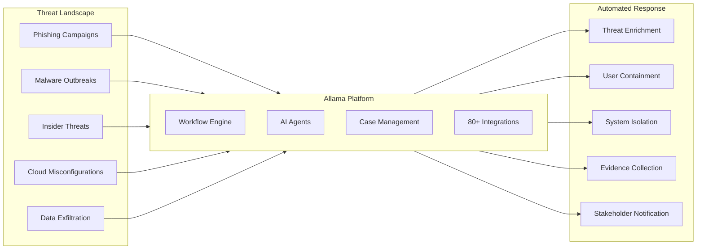
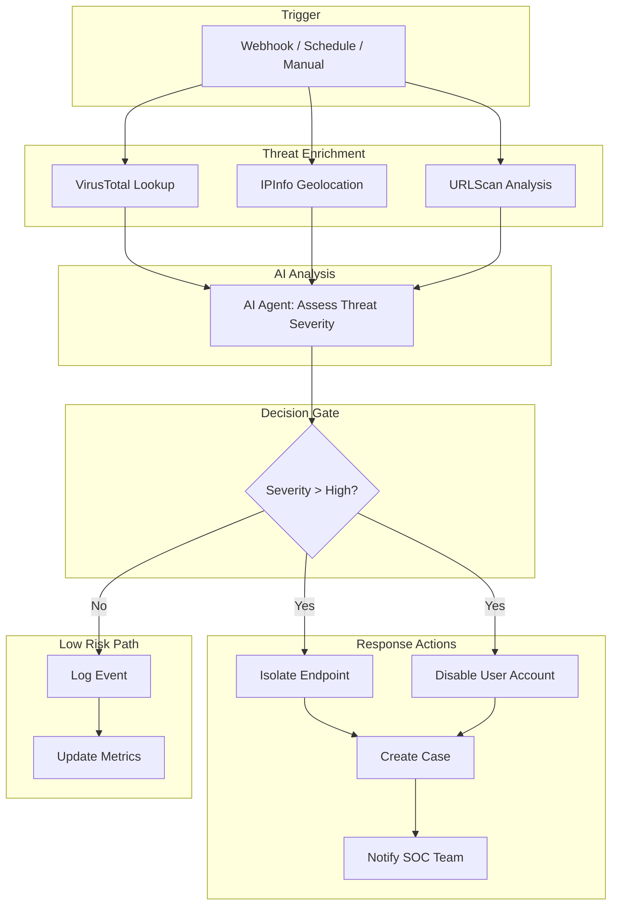
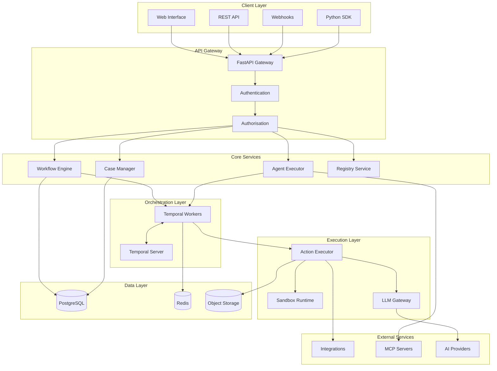

<p align="center">
  
</p>

<h1 align="center">Allama</h1>

<p align="center">
  <strong>Autonomous Security Automation at Infinite Scale</strong>
</p>

<p align="center">
  Deploy unlimited AI-powered security agents. Automate threat response in seconds, not hours.<br/>
  Built for the modern Security Operations Centre.
</p>

<p align="center">
  <a href="https://github.com/digitranslab/allama/blob/main/LICENSE">
    
  </a>
  <a href="https://discord.gg/n3GF4qxFU8">
    
  </a>
  <a href="https://github.com/digitranslab/allama/stargazers">
    
  </a>
</p>

<p align="center">
  <a href="#the-security-imperative">Why Allama</a> |
  <a href="#platform-capabilities">Capabilities</a> |
  <a href="#architecture">Architecture</a> |
  <a href="#deployment">Deployment</a> |
  <a href="#getting-started">Get Started</a>
</p>

---

## The Security Imperative

The digital landscape has fundamentally shifted. Organisations now face:

**Exponential Threat Growth**: Cyber attacks have increased by 300% since 2020, with sophisticated adversaries leveraging AI to automate reconnaissance, exploitation, and lateral movement.

**Data Sprawl Crisis**: Customer data collection across cloud platforms, SaaS applications, and edge devices has created attack surfaces that expand faster than security teams can monitor.

**The Talent Gap**: With 3.4 million unfilled cybersecurity positions globally, organisations cannot hire their way to security. The average SOC analyst processes 500+ alerts daily, with 80% proving to be false positives.

**Response Latency**: Manual incident response processes create dangerous windows between detection and containment. The average breach goes undetected for 197 days.

**Traditional security tools were built for a world that no longer exists.**

---

## The Allama Approach

**Allama** is an open-source security automation platform that deploys autonomous AI agents to defend your infrastructure at machine speed. Unlike legacy SOAR platforms that require extensive programming, Allama combines visual workflow design with intelligent agents that understand context, make decisions, and execute response actions.



---

## Platform Capabilities

### Intelligent Workflow Automation

Build sophisticated security playbooks using a visual no-code interface or YAML-based definitions. Allama workflows execute as durable, fault-tolerant processes that survive infrastructure failures.

| Feature | Description |
|---------|-------------|
| Visual Builder | Drag-and-drop workflow design with real-time validation |
| Conditional Logic | Branch execution based on threat indicators, severity, or custom criteria |
| Parallel Processing | Execute multiple investigation paths simultaneously |
| Loop Constructs | Iterate over indicator lists, user groups, or asset inventories |
| Child Workflows | Compose complex automation from reusable components |
| Scatter-Gather | Distribute work across parallel branches and aggregate results |



### Autonomous AI Agents

Deploy AI agents that understand security context, reason about threats, and execute response actions without human intervention.

| Capability | Description |
|------------|-------------|
| Natural Language Instructions | Define agent behaviour using plain English directives |
| Multi-Model Support | OpenAI, Anthropic, Azure OpenAI, Google, or self-hosted models via Ollama |
| Tool Orchestration | Agents automatically select and execute appropriate security tools |
| Human-in-the-Loop | Configure approval workflows for high-impact actions |
| Context Awareness | Agents maintain conversation history and learn from interactions |
| MCP Integration | Connect to external Model Context Protocol servers for extended capabilities |

### Comprehensive Case Management

Track, investigate, and resolve security incidents with built-in case management that integrates directly with your automation workflows.

| Feature | Description |
|---------|-------------|
| Automated Case Creation | Generate cases from workflow triggers or manual submission |
| Custom Fields | Define organisation-specific metadata schemas |
| Task Management | Assign investigation tasks with workflow automation |
| Priority and Severity | Categorise cases for appropriate response escalation |
| File Attachments | Associate evidence and artefacts with cases |
| Audit Trail | Complete event history for compliance and forensics |
| Tagging System | Organise cases with custom tags and categories |

### Enterprise Integration Ecosystem

Connect to your existing security infrastructure with 80+ pre-built integrations spanning every category of security tooling.

| Category | Integrations |
|----------|-------------|
| SIEM / Log Management | Splunk, Elastic Security, Datadog, Wazuh |
| EDR / XDR | CrowdStrike Falcon, SentinelOne |
| Identity and Access | Okta, Microsoft Entra ID, LDAP, Google Workspace |
| Ticketing and ITSM | Jira, Zendesk, PagerDuty, Rootly |
| Communication | Slack, Microsoft Teams, Email (SMTP) |
| Threat Intelligence | VirusTotal, URLScan, IPInfo, Have I Been Pwned, Anomali ThreatStream |
| Cloud Platforms | AWS (Boto3, S3), Google Cloud, Kubernetes |
| Database | PostgreSQL, MongoDB, Splunk KV Store |
| Vulnerability Management | HackerOne |
| Phishing Simulation | GoPhish |

### Secure Script Execution

Execute custom Python scripts in isolated WebAssembly sandboxes with enterprise-grade security controls.

| Security Control | Implementation |
|------------------|----------------|
| Network Isolation | Scripts run without network access by default |
| Dependency Management | Install PyPI packages on-demand with version pinning |
| Resource Limits | Configurable timeouts and memory constraints |
| Input Validation | Type-safe parameter passing from workflows |
| Audit Logging | Complete execution history for compliance |

---

## Architecture

Allama employs a distributed microservices architecture built on battle-tested infrastructure components. The platform is designed for horizontal scalability, fault tolerance, and security isolation.



### Component Overview

| Component | Technology | Purpose |
|-----------|------------|---------|
| API Gateway | FastAPI | Authentication, authorisation, request routing, OpenAPI documentation |
| Workflow Engine | Custom DSL | YAML parsing, validation, DAG construction, execution coordination |
| Temporal Server | Temporal.io | Durable workflow execution with automatic retry and recovery |
| Agent Executor | PydanticAI | AI agent lifecycle management, tool orchestration, streaming responses |
| Action Executor | Python | Integration execution with secret injection and error handling |
| Sandbox Runtime | WebAssembly | Isolated Python script execution with resource limits |
| Registry | Git-backed | Version-controlled integration and template storage |
| LLM Gateway | LiteLLM | Unified interface to multiple AI providers with credential management |

### Scalability Model

Allama scales horizontally across all tiers:

| Tier | Scaling Strategy |
|------|------------------|
| API Gateway | Horizontal pod autoscaling based on request rate |
| Temporal Workers | Scale based on workflow queue depth |
| Action Executors | Scale based on concurrent action execution |
| Database | Read replicas for query distribution, connection pooling |
| Object Storage | S3-compatible storage with unlimited capacity |

---

## Security Model

### Authentication

| Method | Use Case |
|--------|----------|
| Basic Authentication | Development and testing environments |
| Google OAuth 2.0 | Enterprise SSO via Google Workspace |
| SAML 2.0 | Integration with Okta, Microsoft Entra ID, Keycloak, Authentik |

### Authorisation

| Control | Implementation |
|---------|----------------|
| Role-Based Access | Admin, Editor, and Viewer roles with granular permissions |
| Workspace Isolation | Multi-tenant data segregation with workspace boundaries |
| Organisation Hierarchy | Centralised policy management across workspaces |

### Secrets Management

| Feature | Implementation |
|---------|----------------|
| Encrypted Storage | AES-256 encryption at rest using Fernet |
| Environment Isolation | Separate credentials for development, staging, production |
| Automatic Injection | Secrets resolved at execution time, never logged |
| Audit Logging | Complete access history for compliance |
| OAuth Integration | Built-in OAuth 2.0 credential management with automatic token refresh |

---

## Deployment Options

### Docker Compose

Ideal for development, testing, and small-scale production deployments.

```bash
# Clone the repository
git clone https://github.com/digitranslab/allama.git
cd allama

# Start all services
docker compose -f docker-compose.dev.yml up -d

# Access the UI at http://localhost
```

### AWS ECS Fargate

Production-grade deployment with Terraform infrastructure as code.

| Feature | Implementation |
|---------|----------------|
| Auto-scaling | Horizontal scaling based on workflow load |
| High Availability | Multi-AZ deployment with automatic failover |
| Managed Services | RDS PostgreSQL, ElastiCache Redis, S3 storage |
| Load Balancing | Application Load Balancer with SSL termination |
| Security | Private subnets, security groups, IAM roles |

```bash
# Download Terraform modules
git clone https://github.com/digitranslab/terraform-fargate.git
cd terraform-fargate

# Configure and deploy
terraform init
terraform apply
```

### Kubernetes

Enterprise deployment with Helm charts for maximum flexibility.

| Feature | Implementation |
|---------|----------------|
| Horizontal Pod Autoscaling | Scale workers based on queue depth |
| Pod Disruption Budgets | Maintain availability during updates |
| Network Policies | Micro-segmentation for defence in depth |
| Secrets Integration | Native Kubernetes secrets or external vaults |
| Observability | Prometheus metrics, structured logging |

---

## Getting Started

### Prerequisites

- Docker and Docker Compose
- 4GB RAM minimum (8GB recommended)
- 10GB available disk space

### Quick Start

```bash
# Clone the repository
git clone https://github.com/digitranslab/allama.git
cd allama

# Run the automated setup script
./demo.sh

# Access the application
open http://localhost
```

Default credentials:
- Email: `admin@example.com`
- Password: `AdminPassword123!`

### Your First Workflow

1. Navigate to **Workflows** and click **Create New**
2. Add an **HTTP Request** action from the action palette
3. Configure the action to call a threat intelligence API
4. Add conditional logic based on the response
5. Save and execute the workflow
6. View execution results in the **Runs** panel

---

## Custom Integrations

Extend Allama with organisation-specific integrations using YAML templates or Python functions.

### YAML Action Templates

```yaml
type: action
definition:
  title: Lookup IP Reputation
  description: Query threat intelligence for IP reputation
  namespace: tools.custom
  name: lookup_ip
  secrets:
    - name: threat_intel
      keys: ["API_KEY"]
  expects:
    type: object
    properties:
      ip_address:
        type: string
        description: IP address to lookup
    required: [ip_address]
  steps:
    - ref: query_api
      action: core.http_request
      args:
        url: https://api.threatintel.example/v1/ip/${{ inputs.ip_address }}
        method: GET
        headers:
          Authorization: Bearer ${{ SECRETS.threat_intel.API_KEY }}
  returns: ${{ steps.query_api.result }}
```

### Git Synchronisation

Sync custom integrations from your private Git repository:

1. Configure SSH deploy key in Organisation Settings
2. Add repository URL: `git+ssh://git@github.com/your-org/integrations.git`
3. Sync from Registry page
4. Custom actions appear immediately in workflow builder

---

## Why Allama?

### For Security Operations Centres

| Challenge | Allama Solution |
|-----------|-----------------|
| Alert Fatigue | Automate initial triage and enrichment to reduce noise by 90% |
| Response Latency | Execute containment actions in seconds, not hours |
| Analyst Burnout | Free senior analysts from repetitive tasks for threat hunting |
| Inconsistent Response | Standardise playbooks across the entire team |
| Knowledge Silos | Encode tribal knowledge into reusable workflows |

### For Managed Security Service Providers

| Requirement | Allama Capability |
|-------------|-------------------|
| Multi-Tenancy | Workspace isolation with organisation hierarchy |
| White-Label | Deploy under your own branding |
| API-First | Integrate with existing service delivery platforms |
| Usage Metrics | Track automation ROI per client |
| Scalability | Handle unlimited clients with horizontal scaling |

### For Cloud Security Teams

| Need | Allama Feature |
|------|----------------|
| Cloud-Native | Containerised deployment for any infrastructure |
| Infrastructure as Code | Terraform modules for repeatable deployments |
| Compliance | Audit trails and access controls for regulatory requirements |
| Cost Efficiency | Open-source licensing eliminates per-seat fees |
| Flexibility | Self-hosted deployment keeps data on your infrastructure |

---

## Documentation

Comprehensive documentation is available at [docs.allama.com](https://docs.allama.com):

| Resource | Description |
|----------|-------------|
| [Installation Guide](https://docs.allama.com/quickstart/install) | Self-host Allama on your infrastructure |
| [Quickstart Tutorial](https://docs.allama.com/quickstart/tutorial) | Build your first workflow in 10 minutes |
| [Core Actions](https://docs.allama.com/quickstart/core-actions) | HTTP requests, data transforms, AI actions |
| [Control Flow](https://docs.allama.com/quickstart/control-flow) | Conditionals, loops, and branching logic |
| [Custom Integrations](https://docs.allama.com/tutorials/custom-integrations) | Build and sync your own integrations |
| [API Reference](https://docs.allama.com/api-reference/overview) | Complete REST API documentation |

---

## Contributing

We welcome contributions from the security community. See [CONTRIBUTING.md](CONTRIBUTING.md) for guidelines.

### Development Setup

```bash
# Install Python dependencies
uv sync

# Run backend tests
uv run pytest tests/unit tests/registry

# Install frontend dependencies
pnpm -C frontend install

# Run frontend development server
pnpm -C frontend dev

# Run linting
just lint
```

---

## Community

| Channel | Purpose |
|---------|---------|
| [Discord](https://discord.gg/n3GF4qxFU8) | Real-time community support and discussion |
| [GitHub Issues](https://github.com/digitranslab/allama/issues) | Bug reports and feature requests |
| [Documentation](https://docs.allama.com) | Comprehensive guides and tutorials |

---

## License

Allama is licensed under the [GNU Affero General Public License v3.0](LICENSE).

---

<p align="center">
  <strong>Built by <a href="https://digitranslab.com">DigitransLab</a></strong>
</p>

<p align="center">
  Securing the digital future through intelligent automation.
</p>
