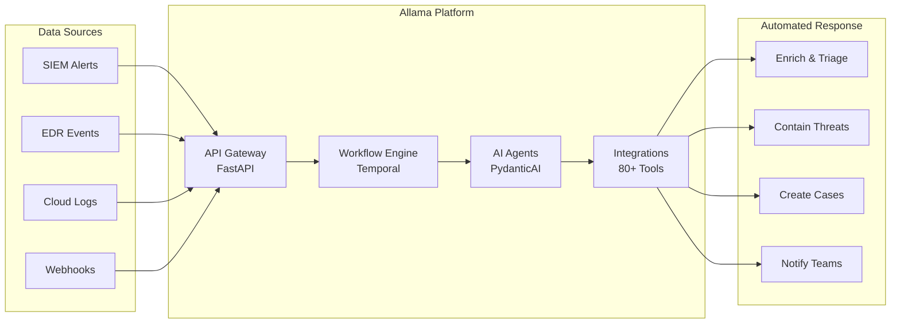

<p align="center">
  
</p>

<h1 align="center">Allama</h1>

<p align="center">
  <strong>Open-Source AI Security Automation</strong>
</p>

<p align="center">
  Automate threat detection and response with AI-powered workflows.<br/>
  Self-hosted. 80+ integrations. Built for modern SOC teams.
</p>

<p align="center">
  <a href="https://github.com/digitranslab/allama/blob/main/LICENSE">
    
  </a>
  <a href="https://discord.gg/2mK6h9rp">
    
  </a>
  <a href="https://github.com/digitranslab/allama/stargazers">
    
  </a>
</p>

<p align="center">
  <a href="#why-allama">Why Allama</a> •
  <a href="#features">Features</a> •
  <a href="#quick-start">Quick Start</a> •
  <a href="#architecture">Architecture</a>
</p>

---

## Why Allama?

Security teams face 500+ alerts daily. Manual investigation is slow, inconsistent, and burns out analysts. Legacy SOAR tools cost $100k+ and require consultants to implement.

**Allama changes this:**

- **90% faster triage** — AI agents enrich and prioritise alerts automatically
- **Zero vendor lock-in** — 100% open source, self-hosted on your infrastructure
- **No coding required** — Visual workflow builder for common automation
- **Enterprise-ready** — Multi-tenant, SSO, audit trails, and compliance controls

---

## Features

### Visual Workflow Builder
Build security playbooks with drag-and-drop. Conditional logic, parallel execution, and loops — no code required.

### AI-Powered Agents
Deploy autonomous agents that understand threats, make decisions, and execute responses. Supports OpenAI, Anthropic, Azure, or self-hosted models via Ollama.

### 80+ Integrations
Connect your entire security stack:</p>

| Category | Tools |
|----------|-------|
| SIEM | Splunk, Elastic, Datadog, Wazuh |
| EDR/XDR | CrowdStrike, SentinelOne |
| Identity | Okta, Microsoft Entra ID, Google Workspace |
| Ticketing | Jira, Zendesk, PagerDuty |
| Communication | Slack, Microsoft Teams, Email |
| Threat Intel | VirusTotal, URLScan, IPInfo, Anomali |
| Cloud | AWS, Google Cloud, Kubernetes |

### Case Management
Track incidents from detection to resolution. Custom fields, task assignment, file attachments, and complete audit trails.

### Secure Script Execution
Run custom Python in isolated WebAssembly sandboxes. Network isolation, resource limits, and full audit logging.

---

## Quick Start

```bash
git clone https://github.com/digitranslab/allama.git
cd allama
make init
make dev
```

Or use the one-click demo script:

```bash
./demo.sh
```

Open http://localhost and start building workflows.

**Requirements:** Docker, Python 3.12+, 4GB RAM, 10GB disk space

---

## Architecture



| Component | Technology | Purpose |
|-----------|------------|---------|
| API Gateway | FastAPI | Authentication, routing, OpenAPI docs |
| Workflow Engine | Temporal | Durable execution with automatic retry |
| AI Agents | PydanticAI + LiteLLM | Multi-model support, tool orchestration |
| Sandbox | WebAssembly | Isolated script execution |
| Database | PostgreSQL | Persistent storage |
| Object Storage | S3-compatible | File attachments, artefacts |

---

## Security

| Feature | Implementation |
|---------|----------------|
| Authentication | Basic, Google OAuth, SAML 2.0 (Okta, Entra ID) |
| Authorisation | Role-based access, workspace isolation |
| Secrets | AES-256 encryption, automatic injection |
| Audit | Complete access and execution history |

---


## Use Cases

**SOC Teams** — Reduce alert fatigue by 90%. Automate triage, enrichment, and containment.

**MSSPs** — Multi-tenant architecture. White-label deployment. API-first integration.

**Cloud Security** — Infrastructure as code. Terraform modules. Self-hosted for data sovereignty.

---

## Community

- [Discord](https://discord.gg/2mK6h9rp) — Real-time support and discussion